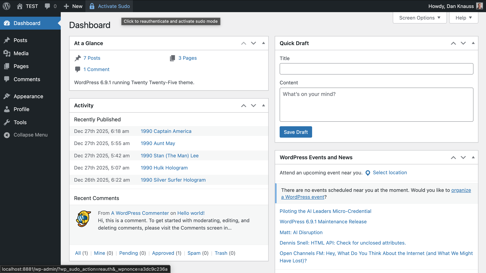
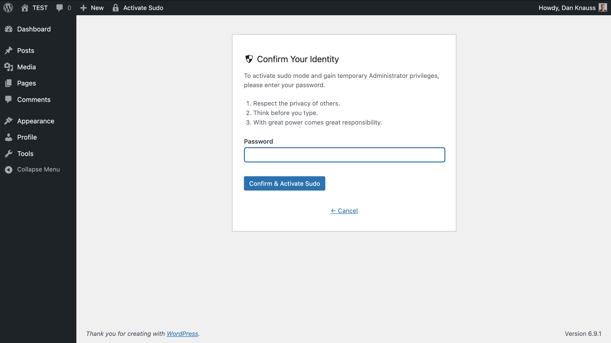
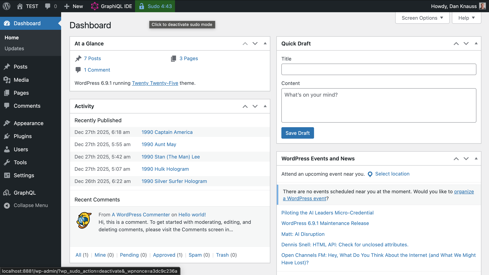
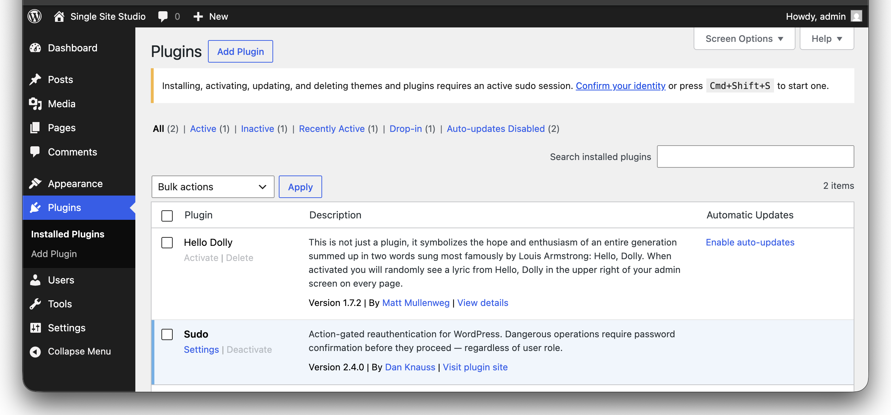

# Sudo for WordPress

**Action-gated reauthentication for WordPress.** Dangerous operations require password confirmation before they proceed — regardless of user role.

[](https://www.gnu.org/licenses/gpl-2.0.html)
[](https://wordpress.org/)
[](https://www.php.net/)

## Description

**Sudo** gates destructive WordPress admin operations behind a reauthentication step. When any user — administrator, editor, or custom role — attempts a dangerous action, they must confirm their identity before proceeding.

This is not role-based escalation. Every logged-in user is treated the same: attempt a gated action, get challenged. WordPress capability checks still run after the gate, so Sudo adds a security layer without changing the permission model.

### What Gets Gated?

| Category | Operations |
|---|---|
| **Plugins** | Activate, deactivate, delete, install, update |
| **Themes** | Switch, delete, install, update |
| **Users** | Delete, change role, create new user, create application password |
| **File editors** | Plugin editor, theme editor |
| **Critical options** | `siteurl`, `home`, `admin_email`, `default_role`, `users_can_register` |
| **WordPress core** | Update, reinstall |
| **Site data export** | WXR export |
| **WP Sudo settings** | Self-protected — settings changes require reauthentication |
| **Multisite** | Network theme enable/disable, site delete/deactivate/archive/spam, super admin grant/revoke, network settings |

Developers can add custom rules via the `wp_sudo_gated_actions` filter.

### How It Works

**Browser requests (admin UI):** The user sees an interstitial challenge page. After entering their password (and 2FA code if configured), the original request is replayed automatically. **AJAX and REST requests** receive a `sudo_required` error; an admin notice on the next page load links to the challenge page. The user authenticates, activates a sudo session, and retries the action.

**Non-interactive requests (WP-CLI, Cron, XML-RPC, Application Passwords):** Configurable per-surface policies. Each can be set to Block (default) or Allow. WP-CLI in Allow mode requires the `--sudo` flag.

### Security Features

- **Role-agnostic** — any user attempting a gated action is challenged, including administrators and compromised accounts.
- **Full attack surface** — admin UI, AJAX, REST API, WP-CLI, Cron, XML-RPC, and Application Passwords are all covered.
- **Session binding** — sudo sessions are cryptographically bound to the browser via a secure httponly cookie token.
- **2FA browser binding** — the two-factor challenge is bound to the originating browser with a one-time challenge cookie, preventing cross-browser replay.
- **Rate limiting** — 5 failed password attempts trigger a 5-minute lockout.
- **Self-protection** — changes to WP Sudo settings require reauthentication.
- **Server-side enforcement** — gating decisions happen in PHP hooks before action handlers. JavaScript is for UX only.

### Recommended Plugins

Sudo works on its own, but these plugins add significant value:

- **[Two Factor](https://wordpress.org/plugins/two-factor/)** — Strongly recommended. When installed, the sudo challenge becomes a two-step process: password + verification code (TOTP, email, backup codes). This is the difference between "confirm you know the password" and "confirm you possess the device." Third-party 2FA plugins can integrate via the `wp_sudo_requires_two_factor`, `wp_sudo_validate_two_factor`, and `wp_sudo_render_two_factor_fields` hooks.

- **[WP Activity Log](https://wordpress.org/plugins/wp-security-audit-log/)** or **[Stream](https://wordpress.org/plugins/stream/)** — Recommended for audit visibility. Sudo fires 8 action hooks covering session lifecycle, gated actions, policy decisions, and lockouts. A logging plugin turns these hooks into a searchable audit trail so you can answer "who did what, and did they reauthenticate?"

### User Experience

- **Admin bar countdown** — a live M:SS timer shows remaining session time when active. Turns red in the final 60 seconds.
- **Countdown on 2FA step** — a visible timer shows how long the user has to enter their verification code.
- **Keyboard shortcut** — press `Ctrl+Shift+S` (Windows/Linux) or `Cmd+Shift+S` (Mac) to proactively start a sudo session without triggering a gated action first. When a session is already active, the shortcut flashes the admin bar timer.
- **Accessible** — screen-reader announcements, ARIA labels, focus management, and keyboard support throughout. WCAG 2.1 AA.
- **Contextual help** — 4 help tabs on the settings page cover how sudo works, settings, extending via filters, and audit hooks.

### MU-Plugin for Early Loading

An optional mu-plugin ensures gate hooks are registered before any other plugin loads. Install it with one click from the settings page, or manually copy the shim to `wp-content/mu-plugins/`. The mu-plugin is a thin stable shim that loads the current gate code from the main plugin directory, so it stays up to date automatically with regular plugin updates.

### Multisite

Settings are network-wide — one configuration for the entire network, managed by super admins under **Network Admin > Settings > Sudo**. Sudo sessions are network-wide — authenticate once, valid across all sites. The action registry includes 8 additional network admin rules (theme enable/disable, site management, super admin grant/revoke, network settings). On uninstall, per-site data is cleaned per-site, and shared user meta is only removed when no remaining site has the plugin active.

## Installation

1. Upload the `wp-sudo` folder to `/wp-content/plugins/`.
2. Activate the plugin through the **Plugins** screen in WordPress.
3. Go to **Settings > Sudo** to configure session duration and entry point policies.
4. (Optional) Install the mu-plugin from the settings page for early hook registration.
5. (Recommended) Install the [Two Factor](https://wordpress.org/plugins/two-factor/) plugin for two-step verification.

## Frequently Asked Questions

### How does sudo gating work?

When a user attempts a gated action — for example, activating a plugin — Sudo intercepts the request at `admin_init` (before WordPress processes it). The original request is stashed in a transient, the user is redirected to a challenge page, and after successful reauthentication, the original request is replayed. For AJAX and REST requests, the browser receives a `sudo_required` error and an admin notice appears on the next page load linking to the challenge page. The user authenticates, activates a sudo session, and retries the action.

### Does this replace WordPress roles and capabilities?

No. Sudo adds a reauthentication layer on top of the existing permission model. WordPress capability checks still run after the gate. A user who does not have the `activate_plugins` capability will still be denied after reauthenticating — Sudo does not grant any new permissions.

### Which operations are gated?

See the table in the Description section above. The settings page also includes a read-only Gated Actions table showing all registered rules and their covered surfaces (Admin, AJAX, REST). Developers can add custom rules via the `wp_sudo_gated_actions` filter.

### What about REST API and Application Passwords?

Cookie-authenticated REST requests (from the block editor, admin AJAX) receive a `sudo_required` error. An admin notice on the next page load links to the challenge page where the user can authenticate and activate a sudo session, then retry the action. Application Password and bearer-token REST requests are governed by a separate policy setting (Block or Allow, default Block). When blocked, these requests receive a 403 error with a `sudo_blocked` code.

### What about WP-CLI, Cron, and XML-RPC?

Each has its own policy setting (Block or Allow, default Block). WP-CLI in Allow mode requires the `--sudo` flag. Blocked operations are logged via audit hooks.

### How does session binding work?

When sudo is activated, a cryptographic token is stored in a secure httponly cookie and its hash is saved in user meta. On every gated request, both must match. A stolen session cookie on a different browser will not have a valid sudo session.

### How does 2FA browser binding work?

When the password step succeeds and 2FA is required, a one-time challenge cookie is set in the browser. The 2FA pending state is keyed by the hash of this cookie, not by user ID. An attacker who stole the WordPress session cookie but is on a different machine does not have the challenge cookie and cannot complete the 2FA step.

### Is there brute-force protection?

Yes. After 5 failed password attempts on the reauthentication form, the user is locked out for 5 minutes. Lockout events fire the `wp_sudo_lockout` action hook for audit logging.

### How do I log sudo activity?

Install [WP Activity Log](https://wordpress.org/plugins/wp-security-audit-log/) or [Stream](https://wordpress.org/plugins/stream/). Sudo fires these action hooks:

- `wp_sudo_activated( $user_id, $expires, $duration )` — session started.
- `wp_sudo_deactivated( $user_id )` — session ended.
- `wp_sudo_reauth_failed( $user_id, $attempts )` — wrong password.
- `wp_sudo_lockout( $user_id, $attempts )` — lockout triggered.
- `wp_sudo_action_gated( $user_id, $rule_id, $surface )` — intercepted, challenge shown.
- `wp_sudo_action_blocked( $user_id, $rule_id, $surface )` — denied by policy.
- `wp_sudo_action_allowed( $user_id, $rule_id, $surface )` — permitted by policy.
- `wp_sudo_action_replayed( $user_id, $rule_id )` — stashed request replayed after reauth.

### Does it support two-factor authentication?

Yes. If the [Two Factor](https://wordpress.org/plugins/two-factor/) plugin is installed and the user has 2FA enabled, the sudo challenge becomes a two-step process: password first, then the configured 2FA method (TOTP, email code, backup codes, etc.). A visible countdown timer shows how long the user has to enter their code. Third-party 2FA plugins can integrate via filter hooks.

### Does it work on multisite?

Yes. Settings are network-wide (one configuration for all sites). Sudo sessions use user meta (shared across the network), so authenticating on one site covers all sites. The action registry includes network-specific rules for theme enable/disable, site management, super admin grant/revoke, and network settings. The settings page appears under **Network Admin > Settings > Sudo**. On uninstall, per-site data is cleaned per-site, and user meta is only removed when no remaining site has the plugin active.

### What is the mu-plugin and do I need it?

The mu-plugin is optional. It ensures Sudo's gate hooks are registered before any other regular plugin loads, preventing another plugin from deregistering the hooks or processing dangerous actions before the gate fires. You can install it with one click from the settings page. The mu-plugin is a thin shim in `wp-content/mu-plugins/` that loads the gate code from the main plugin directory — it updates automatically with regular plugin updates.

### What happens if I deactivate the plugin?

Any active sudo sessions expire naturally. All gated actions return to their normal, ungated behavior. No data is lost. The mu-plugin shim (if installed) safely detects the missing main plugin and does nothing.

### Can I extend the list of gated actions?

Yes. Use the `wp_sudo_gated_actions` filter to add custom rules. Each rule defines matching criteria for admin UI (`pagenow`, actions, HTTP method), AJAX (action names), and REST (route patterns, HTTP methods). Custom rules appear in the Gated Actions table on the settings page and automatically get coverage on non-interactive surfaces.

### Can I change the 2FA verification window?

Yes. The default window is 10 minutes. Use the `wp_sudo_two_factor_window` filter to adjust it (value in seconds).

## Developer Reference

### Gated Action Rule Structure

```php
add_filter( 'wp_sudo_gated_actions', function ( array $rules ): array {
    $rules[] = array(
        'id'       => 'custom.my_action',
        'label'    => 'My dangerous action',
        'category' => 'custom',
        'admin'    => array(
            'pagenow'  => 'admin.php',
            'actions'  => array( 'my_dangerous_action' ),
            'method'   => 'POST',
            'callback' => function (): bool {
                return some_extra_condition();
            },
        ),
        'ajax'     => array(
            'actions' => array( 'my_ajax_action' ),
        ),
        'rest'     => array(
            'route'   => '#^/my-namespace/v1/dangerous#',
            'methods' => array( 'POST', 'DELETE' ),
        ),
    );
    return $rules;
} );
```

### Audit Hook Signatures

```php
// Session lifecycle.
do_action( 'wp_sudo_activated', int $user_id, int $expires, int $duration );
do_action( 'wp_sudo_deactivated', int $user_id );

// Authentication failures.
do_action( 'wp_sudo_reauth_failed', int $user_id, int $attempts );
do_action( 'wp_sudo_lockout', int $user_id, int $attempts );

// Action gating.
do_action( 'wp_sudo_action_gated', int $user_id, string $rule_id, string $surface );
do_action( 'wp_sudo_action_blocked', int $user_id, string $rule_id, string $surface );
do_action( 'wp_sudo_action_allowed', int $user_id, string $rule_id, string $surface );
do_action( 'wp_sudo_action_replayed', int $user_id, string $rule_id );
```

### Filters

| Filter | Description |
|---|---|
| `wp_sudo_gated_actions` | Add or modify gated action rules. |
| `wp_sudo_two_factor_window` | 2FA verification window in seconds (default: 600). |
| `wp_sudo_requires_two_factor` | Whether a user needs 2FA for sudo (for third-party 2FA plugins). |
| `wp_sudo_validate_two_factor` | Validate a 2FA code (for third-party 2FA plugins). |
| `wp_sudo_render_two_factor_fields` | Render 2FA input fields (for third-party 2FA plugins). |

## Screenshots

1. **Challenge page** — a gated action triggers a reauthentication interstitial with the action description and password field.

   

2. **Active sudo session** — the admin bar shows a green countdown timer (M:SS). Turns red in the final 60 seconds.

   

3. **Settings page** — configure session duration and entry point policies. View all gated actions and mu-plugin status.

   

4. **Admin notice** — when an AJAX or REST operation is blocked, an admin notice links to the challenge page for session activation.

   

## Changelog

### 2.0.0

Complete rewrite. Action-gated reauthentication replaces role-based privilege escalation.

- **New model** — gates dangerous operations behind reauthentication for any user, regardless of role. No custom role, no capability escalation.
- **Full attack surface coverage** — admin UI (stash-challenge-replay), AJAX (error + admin notice + session activation), REST API (cookie-auth challenge, app-password policy), WP-CLI, Cron, XML-RPC.
- **Action Registry** — 20 gated rules across 7 categories (plugins, themes, users, editors, options, updates, tools), plus 8 multisite-specific rules. Extensible via `wp_sudo_gated_actions` filter.
- **Entry point policies** — configurable Block/Allow for REST Application Passwords, WP-CLI, Cron, and XML-RPC.
- **2FA browser binding** — challenge cookie prevents cross-browser 2FA replay.
- **2FA countdown timer** — visible countdown during the verification step; configurable window via `wp_sudo_two_factor_window` filter.
- **Self-protection** — WP Sudo settings changes are gated.
- **MU-plugin toggle** — one-click install/uninstall from the settings page. Stable shim + loader pattern keeps the mu-plugin up to date with regular plugin updates.
- **Multisite** — network-wide settings, network-wide sessions, 8 network admin rules, `get_site_option`/`set_site_transient` storage.
- **8 audit hooks** — full lifecycle and policy logging for integration with WP Activity Log, Stream, and similar plugins.
- **Contextual help** — 4 help tabs on the settings page.
- **Accessibility** — WCAG 2.1 AA throughout (ARIA labels, focus management, status announcements, keyboard support).
- **281 unit tests, 686 assertions.**

### 1.2.1

- In-place modal reauthentication; no full-page redirect.
- AJAX activation, accessibility improvements, expanded test suite.

### 1.2.0

- M:SS countdown timer, red bar at 60 seconds, accessibility improvements.
- Multisite-safe uninstall, contextual Help tab.

### 1.1.0

- 15-minute session cap, two-factor authentication support, `unfiltered_html` restriction.

### 1.0.0

- Initial release.
